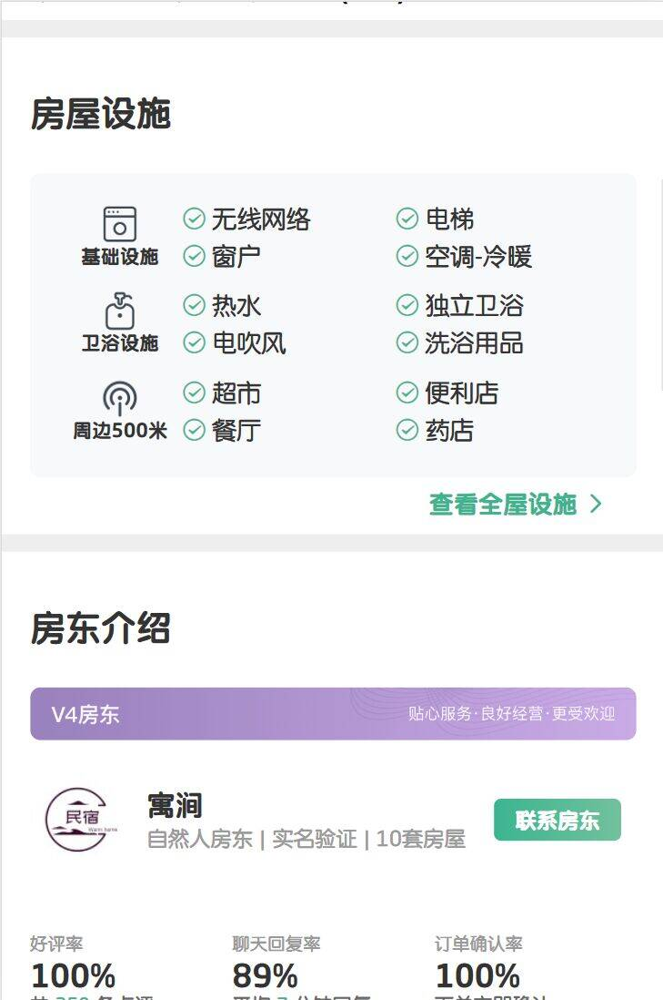
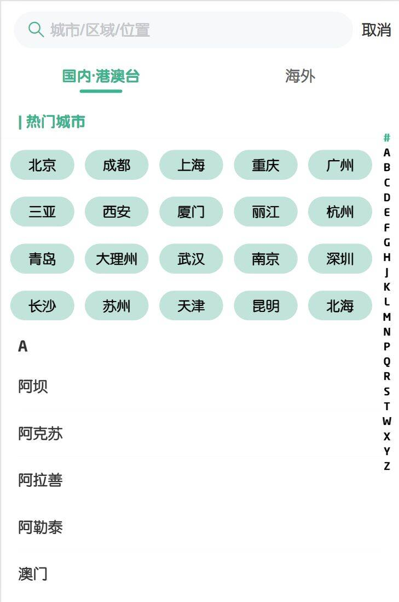
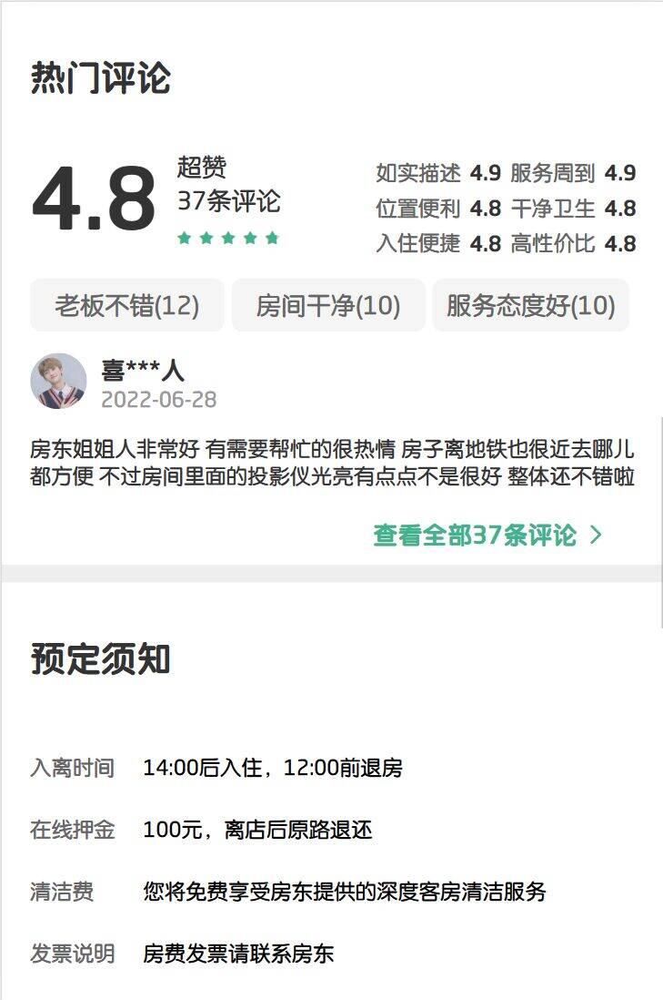
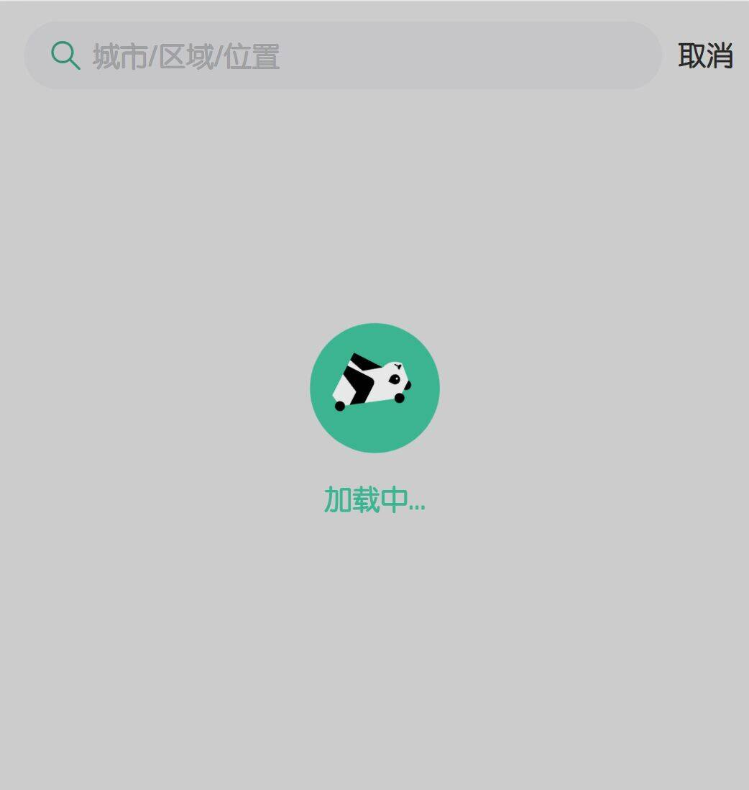
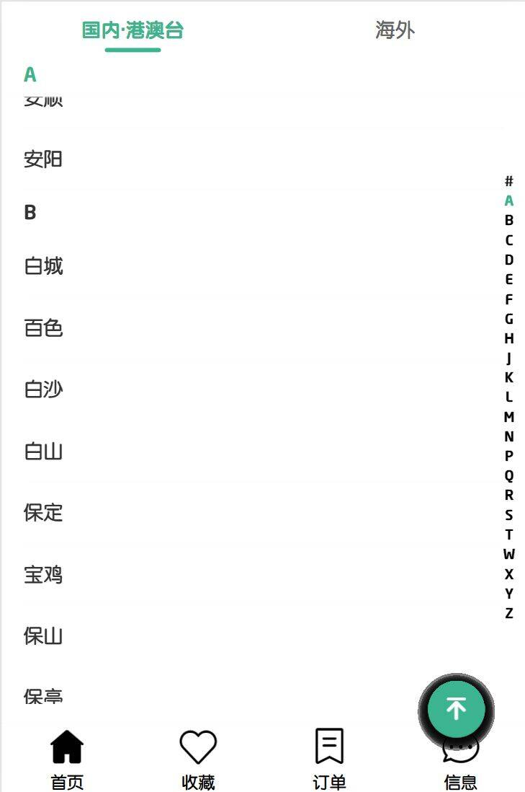
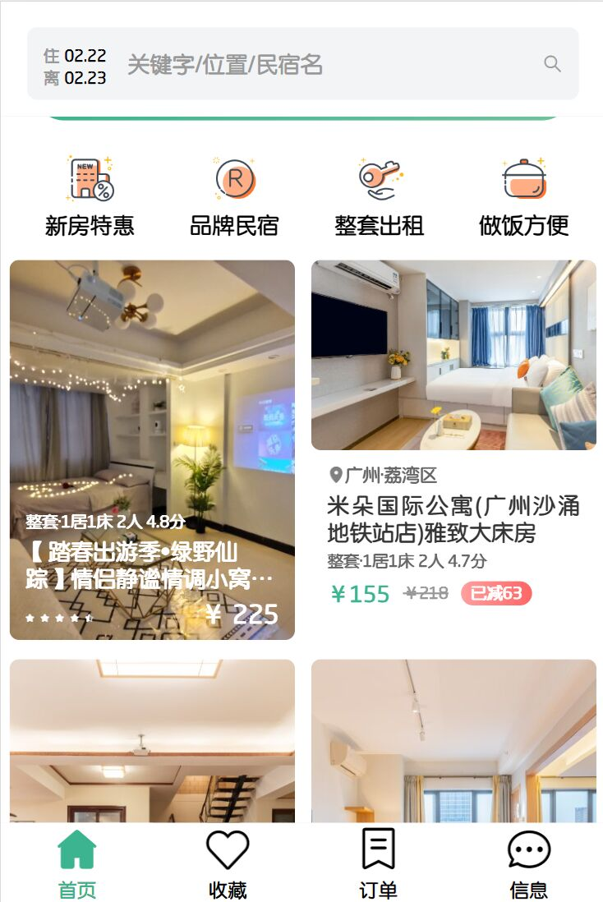

## 项目简介

熊猫旅途项目包含从首页浏览房子，房子详情，查看评价等功能(功能完善中)。

### 技术栈

- 前端框架：(Vue3 + vite)
- 状态管理：[pinia](https://pinia.vuejs.org/zh/)
- 组件库：[vant4](https://vant-contrib.gitee.io/vant/#/zh-CN/home)


## 运行程序

1. 安装依赖
# npm
npm i --registry=https://registry.npmmirror.com


2. 运行程序
npm run dev


# 工程结构解析

```
├── .husky                     # Git Hooks
├── .vscode                    # VS Code 插件 + 设置
├── dist                       # 打包文件夹（可删除重新打包）
├── src                        # 源代码
│   ├── assets                 # 静态资源
│   ├── components             # 全局组件
│   └── hooks                  # 全局函数
│   │    └── useScroll           # 初始化页面大小等
│   ├── router                 # 路由配置
│   └── service                # api接口相关
│   │    ├── modules             # 各模块相关接口
│   │    └── index               # axios实例配置
│   └── store                  # pinia状态管理
│   │    └── modules             # 各模块相关状态
│   ├── utils                  # 全局样式
│   └── views                  # 主包页面
│       ├── city                # 城市分类
│       ├── detail              # 房屋详情
│       ├── favor               # 收藏页
│       ├── home                # 首页
│       ├── order               # 订单页
│       └── message             # 信息页
│       └── App.vue                 # 应用入口文件
│   ├── utils                  # 全局方法
│   ├── App.vue                # 入口页面
│   ├── main.ts                # Vue初始化入口文件
│   ├── pages.json             # 配置页面路由等页面类信息
│   ├── manifest.json          # 配置appid等打包信息
│   └── uni.scss               # uni-app 内置的常用样式变量
├── .editorconfig              # editorconfig 配置
├── .eslintrc.cjs              # eslint 配置
├── .prettierrc.json           # prettier 配置
├── .gitignore                 # git 忽略文件
├── index.html                 # H5 端首页
├── package.json               # package.json 依赖
├── tsconfig.json              # typescript 配置
└── vite.config.ts             # vite 配置
```

# 部分页面截取
## 首页


## 分类


## 商品详情




## 购物车


## 结算


## 个人中心


